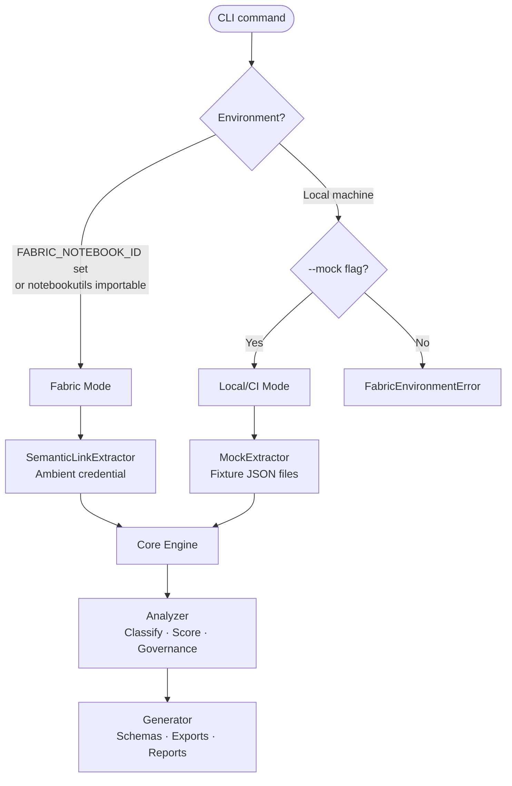

# ⚡ fabric-ai-meta


Extract metadata from Microsoft Fabric semantic models and generate AI-ready outputs —
automating what Microsoft expects teams to do manually across 10–100+ models.

<br>

<table>
<tr>
<td width="50%">

**📊 AI Schema Exports**
LangChain tool definitions · OpenAI function calling · Semantic Kernel plugin manifests · AutoGen tool definitions

</td>
<td width="50%">

**🤖 Prep for AI Automation**
AI Data Schema · AI Instructions · Verified Answers · LLM description backfill

</td>
</tr>
<tr>
<td width="50%">

**🔍 Cross-Model Governance**
Naming inconsistencies · Duplicate measures · Readiness scorecard

</td>
<td width="50%">

**🔄 Bulk Workspace Scan**
All models in one command · Per-model outputs · Score ranking

</td>
</tr>
</table>

---

## 📋 Contents

| | |
|---|---|
| [🏗 Architecture](#-architecture) | [🚀 Installation](#-installation) |
| [💻 Usage](#-usage) | [📂 Output Files](#-output-files) |
| [🧠 LLM Enrichment](#-llm-enrichment) | [🛠 Development](#-development) |

---

## 🏗 Architecture

`sempy.fabric` requires the Microsoft Fabric notebook runtime and does not work locally.
The tool operates in two modes detected automatically at startup:



| Mode | Where it runs | Extractor | Auth |
|------|--------------|-----------|------|
| **Fabric mode** | Fabric notebook | `SemanticLinkExtractor` | Ambient (automatic) |
| **Local/CI mode** | Any machine | `MockExtractor` + fixture JSON | None needed |

> **Every command supports `--mock`** — `analyze`, `scan`, `export`, `score`, and `governance` all work locally without a Fabric connection.

---

## 🚀 Installation

```bash
pip install -e ".[dev]"
```

Verify the install:

```bash
fabric-ai-meta --help
```

---

## 💻 Usage

<details>
<summary><strong>analyze</strong> — extract, classify, score, and export a single model</summary>

```bash
# Local dev with mock fixtures
fabric-ai-meta analyze "Adventure Works" --workspace "Production" --mock

# With LLM enrichment (generates missing descriptions)
fabric-ai-meta analyze "Adventure Works" --workspace "Production" --mock --llm-enrich

# Specify output directory
fabric-ai-meta analyze "Adventure Works" --workspace "Production" --mock --output ./output
```
</details>

<details>
<summary><strong>scan</strong> — bulk scan all models in a workspace</summary>

```bash
fabric-ai-meta scan --workspace "Production" --mock --output ./output
```

Produces per-model output directories and a `workspace-summary.json` with score ranking.
</details>

<details>
<summary><strong>export prep-for-ai</strong> — generate Prep for AI config</summary>

```bash
# Rule-based (no LLM)
fabric-ai-meta export prep-for-ai "Adventure Works" --workspace "Production" --mock

# With LLM-generated AI instructions
fabric-ai-meta export prep-for-ai "Adventure Works" --workspace "Production" --mock --llm-enrich
```

Output is a `prep-for-ai-config.json` you apply manually in Power BI Desktop or Fabric Service.
No public API exists for programmatic application.
</details>

<details>
<summary><strong>governance</strong> — cross-model analysis and scorecard</summary>

```bash
fabric-ai-meta governance --workspace "Production" --mock --report ./governance-report.json
```

Detects naming inconsistencies, duplicate DAX expressions, and ranks models by AI readiness.
</details>

<details>
<summary><strong>score</strong> — AI readiness score for a model</summary>

```bash
fabric-ai-meta score "Adventure Works" --workspace "Production" --mock
```
</details>

<details>
<summary><strong>export</strong> — framework-specific exports</summary>

```bash
fabric-ai-meta export langchain "Adventure Works" --workspace "Production" --mock
fabric-ai-meta export openai "Adventure Works" --workspace "Production" --mock
fabric-ai-meta export semantic-kernel "Adventure Works" --workspace "Production" --mock
fabric-ai-meta export autogen "Adventure Works" --workspace "Production" --mock
```
</details>

---

## 📂 Output Files

### Per-model (written to `{output}/{model-slug}/`)

| File | Description |
|------|-------------|
| `ai-ready-schema.json` | Full AI-ready schema — tables, measures, query guidance, scoring |
| `langchain-tool.json` | LangChain tool definition |
| `openai-function.json` | OpenAI function calling schema |
| `semantic-kernel-plugin.json` | Semantic Kernel plugin manifest |
| `autogen-tool.json` | AutoGen tool definition with full model context |
| `prep-for-ai-config.json` | Prep for AI settings with step-by-step application guide |
| `readiness-score.json` | AI readiness score and component breakdown |
| `measure-dependency-graph.json` | DAX measure dependency graph |
| `extraction-raw.json` | Raw extracted metadata |

### Workspace-level

| File | Description |
|------|-------------|
| `workspace-summary.json` | Score ranking, recommendations, model inventory across all models |
| `governance-report.json` | Cross-model naming issues, duplicate measures, governance scorecard |

---

## 🧠 LLM Enrichment

Add `--llm-enrich` to any command to enable Claude-powered analysis:

```bash
export ANTHROPIC_API_KEY=sk-ant-...

fabric-ai-meta analyze "Adventure Works" --workspace "Production" --mock --llm-enrich
```

**What LLM enrichment adds:**
- Missing table/column/measure descriptions (batch-generated, cached)
- Natural-language grain detection for fact tables
- AI Instructions text for Prep for AI configs

**Cost controls** — configure in `.fabric-ai-meta.toml`:

```toml
[llm]
max_cost_per_run = 0.20   # raises CostLimitExceededError if exceeded
cache_enabled = true       # SHA-256 keyed file cache — no TTL
```

---

## 📦 Library API

Use `fabric-ai-meta` as a Python library — all public functions are importable from the top-level package:

```python
from fabric_ai_meta import (
    MockExtractor,
    SemanticModelMeta,
    score_model,
    generate_ai_ready_schema,
    to_openai_function,
    to_langchain_tool_definition,
    classify_table_heuristic,
)

# Load a model from fixture
extractor = MockExtractor(fixture_path="tests/fixtures/adventure_works.json")
model = extractor.extract()

# Score it
score, breakdown = score_model(model)

# Generate exports
schema = generate_ai_ready_schema(model)
openai_fn = to_openai_function(model)
```

See `fabric_ai_meta.__all__` for the full list of 25 public exports.

---

## 🛠 Development

```bash
# Install dev dependencies
pip install -e ".[dev]"

# Run full test suite (222 tests, no Fabric runtime or real LLM calls required)
pytest tests/ -x -q

# Run with coverage
pytest tests/ --cov=fabric_ai_meta
```

All tests run locally. Fabric-dependent code is mocked via `MockExtractor` and fixture JSON files in `tests/fixtures/`.

---

## ⚙️ Environment Variables

| Variable | Required | Description |
|----------|----------|-------------|
| `ANTHROPIC_API_KEY` | For `--llm-enrich` only | Claude API key |
| `FABRIC_NOTEBOOK_ID` | Auto-set in Fabric | Signals Fabric notebook runtime |
