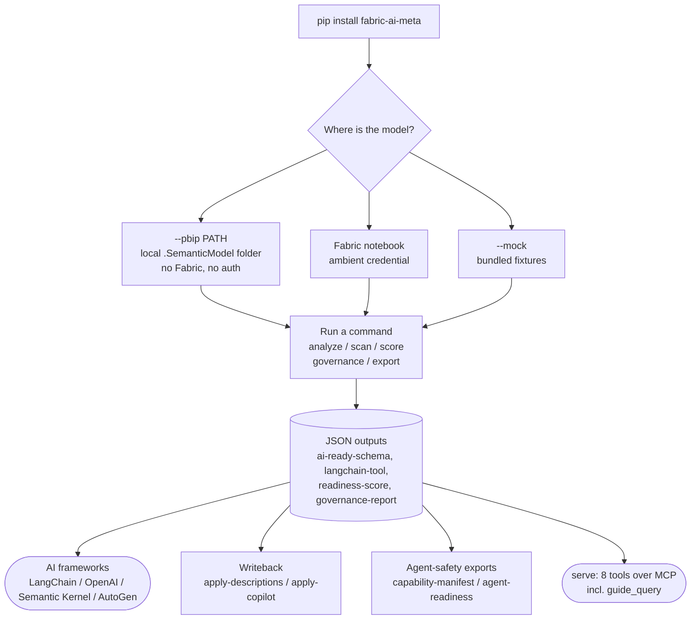

# End-to-End User Guide

A plain-language walk-through of every fabric-ai-meta capability, in the order a typical user adopts them. Start at step 1 if you are new; jump to a numbered step if you know what you need.

This guide is the per-command reference; the [README](../README.md) is the short version. For CI/CD recipes see [`ci-cd-guide.md`](ci-cd-guide.md). For building your own exporter see [`plugin-development.md`](plugin-development.md). Run any command with `--help` for its exact flags.

The whole flow at a glance:



---

## 1. Install

```bash
pip install fabric-ai-meta             # core
pip install 'fabric-ai-meta[llm]'      # add multi-provider LLM enrichment
pip install 'fabric-ai-meta[mcp]'      # add the MCP server
pip install 'fabric-ai-meta[fabric]'   # add live Fabric extraction and writeback (notebook runtime)
```

Install everything at once: `pip install 'fabric-ai-meta[llm,mcp,dev]'`.

For development against the source tree:

```bash
git clone https://github.com/psistla/fabric-ai-meta.git
cd fabric-ai-meta
pip install -e ".[dev]"
```

For airgapped or restricted environments that cannot reach PyPI directly, download the wheel from the GitHub release page on a connected machine and upload it as a workspace library (Fabric environment libraries, internal artifact registry, etc.). Every release attaches both `fabric_ai_meta-X.Y.Z-py3-none-any.whl` and `fabric_ai_meta-X.Y.Z.tar.gz`.

---

## 2. Extract from a local model (.pbip / TMDL, no Fabric)

The fastest way to see real output is to point the tool at a model you already have. In Power BI Desktop, open your report and choose **File > Save As > Power BI project (.pbip)**. That writes a `*.SemanticModel` folder of TMDL to disk. No sign-in, no tenant. Then:

```bash
# One model
fabric-ai-meta analyze "Your Model" --pbip ./YourModel.SemanticModel --output ./output

# A whole Git Integration repo of *.SemanticModel folders
fabric-ai-meta scan --pbip ./git-integration-repo --output ./output
fabric-ai-meta score --all --pbip ./git-integration-repo
fabric-ai-meta governance --pbip ./git-integration-repo --output ./gov
```

`--pbip` is available on `analyze`, `scan`, `score`, `governance`, and every `export` command. It is mutually exclusive with `--mock` and `--workspace` (you point at a folder, not a workspace), and it reads any sibling `Copilot/` folder automatically.

You get 7 files in `./output/your-model/`:

| File | What it is |
|------|------------|
| `ai-ready-schema.json` | Full structured metadata (tables, measures, query guidance, scoring) |
| `langchain-tool.json` | LangChain `StructuredTool` definition |
| `openai-function.json` | OpenAI function calling schema |
| `semantic-kernel-plugin.json` | Microsoft Semantic Kernel plugin manifest |
| `readiness-score.json` | AI readiness score with component breakdown |
| `measure-dependency-graph.json` | DAX measure dependency graph |
| `extraction-raw.json` | Raw extracted metadata |

**What score to expect from a local model.** Sample values are never read from disk, so a `.pbip` extraction cannot reach a perfect score. A well-modeled model with at least one attribute or measure column tops out around **0.90**; if its rule-eligible measures carry no hardcoded literal (for example a plain `TOTALYTD` with no filter), the achievable maximum drops to about **0.75**. Treat the number as a documentation-and-structure readiness signal, not a grade out of 1.0.

**No model handy?** Three sample models ship with the package (Adventure Works, Contoso Sales, Enterprise Sales). Swap `--pbip <folder>` for `--mock` to run the exact same flow on them:

```bash
fabric-ai-meta analyze "Adventure Works" --mock --output ./output
```

---

## 3. Connect to real Fabric

Two ways:

**Inside a Fabric notebook (recommended).** Open a notebook in your Fabric workspace and run:

```python
%pip install 'fabric-ai-meta[fabric]'
!fabric-ai-meta analyze "Sales Model" --workspace "Production"
```

Ambient Entra credentials are picked up automatically. The CLI detects the notebook environment via the `FABRIC_NOTEBOOK_ID` environment variable. The runtime usually already provides `sempy`; the `[fabric]` extra may upgrade it.

**On your laptop.** Live `--workspace` extraction and `auth login` require the Fabric notebook runtime and the `[fabric]` extra; `sempy.fabric` cannot reach a workspace from a local machine regardless of credentials. To read a real model locally, point `--pbip` at a Power BI project folder instead:

```bash
fabric-ai-meta analyze "Sales Model" --pbip path/to/Sales.SemanticModel
```

**Which commands accept which source.** Anything that only *reads* a model supports all three. Anything that *writes back* to Fabric drops `--pbip` — there's nothing on disk to write to.

| Command | `--mock` | `--pbip` | `--workspace` |
|---|:---:|:---:|:---:|
| `analyze` | ✅ | ✅ | ✅ |
| `scan` | ✅ | ✅ | ✅ |
| `governance` | ✅ | ✅ | ✅ |
| `score` | ✅ | ✅ | ✅ |
| `export langchain / openai / semantic-kernel / autogen` | ✅ | ✅ | ✅ |
| `export copilot` | ✅ | ✅ | ✅ |
| `export capability-manifest` | ✅ | ✅ | ✅ |
| `export agent-readiness` | ✅ | ✅ | ✅ |
| `export prep-for-ai` | ✅ | ❌ | ✅ |
| `apply-descriptions` | ✅ | ❌ | ✅ (required) |
| `apply-copilot` | ✅ | ❌ | ✅ (required) |
| `diff` | — takes two `workspace-summary.json` files, not a live source | | |
| `serve` (MCP) | — no startup mode; each tool call passes its own `pbip=` / `mock=` | | |

**What to expect from each mode**, one command at a time:

| Command | `--mock` | `--pbip` | `--workspace` |
|---|---|---|---|
| `analyze` | Extracts one bundled sample model, writes AI-ready exports and a readiness score. | Extracts your local `.SemanticModel` folder, writes the same exports. | Extracts a live model from Fabric (notebook only), writes the same exports. |
| `scan` | Analyzes every bundled sample model, writes one ranked `workspace-summary.json`. | Analyzes every `.SemanticModel` folder under the directory given, same summary. | Analyzes every model in a live workspace, same summary. |
| `governance` | Runs naming/duplicate/graph-necessity checks across all bundled samples. | Runs the same checks across your local `.SemanticModel` folders. | Runs the same checks across every model in a live workspace. |
| `score` | Computes the readiness score for a bundled sample model (`--all` scores every sample). | Computes the score for your local model on disk. | Computes the score for a live model in Fabric. |
| `export langchain/openai/semantic-kernel/autogen` | Builds the tool definition from a bundled sample model. | Builds it from your local `.SemanticModel` folder. | Builds it from a live Fabric model. |
| `export copilot` | Mirrors `Copilot/` from a sample's `.copilot.json` sidecar (empty if that sample has none). | Mirrors the real `Copilot/` folder shipped inside your local model. | Mirrors `Copilot/` fetched live via Fabric REST `getDefinition`. |
| `export capability-manifest` | Lists measures a bundled sample model can answer. | Lists measures your local model can answer. | Lists measures a live Fabric model can answer. |
| `export agent-readiness` | Ranks fixes needed on a bundled sample model. | Ranks fixes needed on your local model. | Ranks fixes needed on a live Fabric model. |
| `export prep-for-ai` | Generates a Prep-for-AI config from a bundled sample model. | Not supported — no `--pbip` flag on this command. | Generates the config from a live Fabric model. |
| `apply-descriptions` | Simulates a writeback; no real change is made. | Not supported — writeback needs a real Fabric target. | Writes descriptions to a live model via XMLA/TOM. |
| `apply-copilot` | Simulates applying a `Copilot/` folder; no real change is made. | Not supported — same reason. | Applies the `Copilot/` folder to a live model via REST `updateDefinition`. |

---

## 4. Configure your project (optional)

Drop a `.fabric-ai-meta.toml` in your working directory:

```toml
[extraction]
default_workspace = "Production Analytics"
include_sample_values = false

[llm]
provider = "anthropic"
model = "claude-sonnet-4-6"
api_key_env = "ANTHROPIC_API_KEY"
cache_enabled = true
max_cost_per_run = 0.20

[output]
output_dir = "./fabric-output"
```

Set the matching API key environment variable (`ANTHROPIC_API_KEY`, `OPENAI_API_KEY`, `GEMINI_API_KEY`, etc.) and you are done. Subsequent commands pick up the workspace, output directory, and LLM settings automatically.

Full provider matrix (10+ providers) is in [Choosing a provider](#choosing-a-provider) below.

---

## 5. Bulk-scan a whole workspace

```bash
fabric-ai-meta scan --workspace "Production" --output ./output
```

Loops over every semantic model in the workspace and produces:

- A per-model output directory (the same 7 files described in step 2) for every model
- A top-level `workspace-summary.json` with score ranking and recommendations across all models

Track readiness over time:

```bash
fabric-ai-meta scan --workspace "Production" --output ./current \
  --baseline ./previous/workspace-summary.json
```

Produces a delta report: new and removed models, score regressions, table-count changes.

---

## 6. Generate AI-ready exports

One command per framework:

```bash
fabric-ai-meta export langchain "Sales Model" --workspace "Production"
fabric-ai-meta export openai "Sales Model" --workspace "Production"
fabric-ai-meta export semantic-kernel "Sales Model" --workspace "Production"
fabric-ai-meta export autogen "Sales Model" --workspace "Production"
```

Drop the output straight into agent code:

```python
import json
tool_def = json.load(open("output/sales-model/openai-function.json"))
# pass to OpenAI function-calling API
```

---

## 7. Turn on LLM enrichment (fill in the gaps)

Raw Fabric metadata is often incomplete: missing descriptions, fuzzy table types, no grain statements. Add `--llm-enrich` to any extraction command:

```bash
fabric-ai-meta analyze "Sales Model" --workspace "Production" --llm-enrich
```

The LLM does three things:

- Generates missing table, column, and measure descriptions in batches
- Classifies ambiguous tables as fact, dimension, or bridge
- Detects fact-table grain in plain English

Responses are cached by SHA-256 hash of the prompt, so re-runs are free. The `max_cost_per_run` setting in your TOML caps spend per command.

### Choosing a provider

`pip install 'fabric-ai-meta[llm]'` adds multi-provider support through LiteLLM. Set the provider in `.fabric-ai-meta.toml`:

| Provider | `provider` | `model` example | API key env var |
|----------|-----------|-----------------|-----------------|
| Anthropic | `anthropic` | `claude-sonnet-4-6` | `ANTHROPIC_API_KEY` |
| OpenAI | `openai` | `gpt-4o` | `OPENAI_API_KEY` |
| Google Gemini | `google` | `gemini-2.5-pro` | `GEMINI_API_KEY` |
| xAI Grok | `xai` | `grok-4` | `XAI_API_KEY` |
| Mistral | `mistral` | `mistral-large-latest` | `MISTRAL_API_KEY` |
| Cohere | `cohere` | `command-r-plus` | `COHERE_API_KEY` |
| AWS Bedrock | `bedrock` | `anthropic.claude-sonnet-4-v1:0` | `AWS_*` (SDK default chain) |
| Azure OpenAI | `azure` | `<deployment-name>` | `AZURE_OPENAI_API_KEY` |
| Google Vertex AI | `vertex` | `gemini-2.5-pro` | `GOOGLE_APPLICATION_CREDENTIALS` |
| OpenAI-compatible | `openai-compatible` | `<any>` (set `base_url`) | `OPENAI_COMPATIBLE_API_KEY` |

The `openai-compatible` provider routes through any OpenAI-API-compatible host: Groq, Together, Fireworks, Ollama, LM Studio, vLLM, or a custom endpoint.

```toml
# Azure OpenAI
[llm]
provider = "azure"
model = "gpt-4o-deployment"
api_key_env = "AZURE_OPENAI_API_KEY"
azure_endpoint = "https://my-resource.openai.azure.com"
azure_api_version = "2024-02-15-preview"
```

```toml
# Local Ollama, nothing leaves your machine
[llm]
provider = "openai-compatible"
model = "llama3.1"
base_url = "http://localhost:11434"
api_key_env = "OPENAI_COMPATIBLE_API_KEY"  # any non-empty value works
```

```toml
# Cost controls, applied to every provider
[llm]
max_cost_per_run = 0.20   # raises CostLimitExceededError if exceeded
cache_enabled = true      # SHA-256 keyed file cache, no TTL
```

One more environment variable matters outside the LLM path: `FABRIC_NOTEBOOK_ID` is set automatically inside Fabric and is what signals the notebook runtime.

---

## 8. Automate Prep for AI

Microsoft's Prep for AI wizard requires manual configuration for every model. Skip the wizard:

```bash
fabric-ai-meta export prep-for-ai "Sales Model" --workspace "Production" --llm-enrich
```

Produces a `prep-for-ai-config.json` with:

- The list of tables to include (staging and bridge tables excluded automatically)
- LLM-generated AI Instructions text
- Verified Answers (sample question plus DAX measure)
- Hidden columns flagged for exclusion
- Description backfill for every undocumented object

Apply the file content step by step in the Fabric Prep for AI UI. The Prep for AI surface has no public API; this command automates everything up to the manual UI paste.

---

## 9. Write descriptions back to the live model

After LLM enrichment, push the generated descriptions back to your semantic model:

```bash
# Preview locally without contacting Fabric
fabric-ai-meta apply-descriptions ./output/sales-model/prep-for-ai-config.json --mock

# Dry-run against the live model (default behavior, safe)
fabric-ai-meta apply-descriptions ./prep-for-ai-config.json --workspace "Production"

# Commit the changes through XMLA / TOM
fabric-ai-meta apply-descriptions ./prep-for-ai-config.json --workspace "Production" --no-dry-run
```

Writeback uses the Tabular Object Model. Live commits must run inside a Fabric notebook runtime. The local `--mock` mode prints the writeback plan without making any service call.

---

## 10. Cross-model governance report

```bash
fabric-ai-meta governance --workspace "Production" --report ./governance-report.json
```

Produces a JSON report covering:

- Naming inconsistencies (`Total_Sales` vs `Total Sales` vs `TotalSales` flagged together)
- Duplicate DAX expressions (same calculation under different measure names)
- Description coverage percentage per model
- AI readiness score rankings across the workspace

Two optional sections extend the report:

```bash
# Copilot completeness: which models have AI Instructions, Verified Answers, an AI Data Schema
fabric-ai-meta governance --workspace "Production" --with-copilot --report ./gov.json

# Graph-necessity: does each model's workload actually justify an ontology?
fabric-ai-meta governance --workspace "Production" --graph-necessity --report ./gov.json
```

### Do you even need an ontology? (`--graph-necessity`)

Knowledge graph projects are expensive and most semantic models do not need one: a star schema with good descriptions already answers the questions people ask. This check gives you a verdict per model before you fund the project. It runs over metadata you have already extracted, with no Fabric capacity and no LLM calls.

```bash
fabric-ai-meta governance --pbip ./models --graph-necessity --report ./gov.json
```

The report gains a `graph_necessity` array:

```json
{
  "name": "Contoso Sales",
  "tier": "GRAPH_UNNECESSARY",
  "pressure": 0.0,
  "confidence": "evidenced",
  "evidence": [
    "4 of 4 questions resolve within <=2 tables (flat aggregation)",
    "no bridge or many-to-many relationships",
    "relationship graph is a shallow star (diameter 2)",
    "single fact table"
  ],
  "recommendation": "Described schema suffices; defer ontology/graph adoption."
}
```

`tier` is one of `GRAPH_UNNECESSARY`, `GRAPH_OPTIONAL`, `GRAPH_WARRANTED`. `pressure` is a 0.0 to 1.0 blend of four weighted signals:

| Signal | Weight | What it measures |
|--------|--------|------------------|
| `workload_hop_pressure` | 0.35 | Fraction of real questions that traverse 3 or more tables |
| `bridge_m2m_presence` | 0.25 | Bridge tables and many-to-many relationships mediating the model |
| `relationship_graph_depth` | 0.20 | Diameter of the largest connected component, above a plain star |
| `multi_fact_complexity` | 0.20 | Extra fact tables implying cross-fact or drill-across questions |

**Feed it real questions.** `confidence` tells you how much to trust the verdict, and it depends entirely on where the questions came from:

```bash
fabric-ai-meta governance --pbip ./models --graph-necessity \
  --questions ./questions.txt --report ./gov.json
```

`--questions` takes one question per line, or a JSON list of strings. Precedence is: your file (`confidence: strong`), then Copilot example prompts (`evidenced`), then measure dependencies (`evidenced`), then nothing usable, in which case the workload signal drops out entirely, the remaining three weights renormalize, and `confidence` reads `directional`.

Questions are matched against table and column names. If fewer than half of yours resolve against the model's vocabulary, `confidence` drops to `directional` and an evidence line reports the coverage, because a workload score computed from mostly-empty question sets should not read as strong. Phrase questions using the names that exist in the model.

The measure-dependency fallback is a conservative proxy: DAX names columns in one or two tables, while real multi-hop traversal happens through relationships at query time. That biases the fallback verdict toward `GRAPH_UNNECESSARY`, so supply real questions when the answer matters. Report-visual mining and query-log analysis would be stronger signals and are not built yet.

Also available from Python and over MCP:

```python
from fabric_ai_meta import assess_graph_necessity
verdict = assess_graph_necessity(model, questions=["revenue by region and product and store"])
```

---

## 11. Wire into CI/CD

Drop a governance check into your PR pipeline:

```yaml
- run: pip install fabric-ai-meta
- run: fabric-ai-meta governance --workspace "$WORKSPACE" --report report.json --mock
- run: python scripts/ci-governance-check.py report.json --min-score 0.7
```

The PR fails when readiness drops below the threshold. Full guide with ready-to-paste GitHub Actions and Azure DevOps workflows: [`docs/ci-cd-guide.md`](ci-cd-guide.md).

---

## 12. Expose to AI agents through MCP

Start the MCP server:

```bash
fabric-ai-meta serve                                            # stdio (default; auto-discovered by IDEs)
fabric-ai-meta serve --transport streamable-http --port 8000    # HTTP
```

The project ships a `.mcp.json` at the repository root so any MCP-aware IDE auto-discovers the server when the working directory is opened.

Eight tools are exposed to agents:

- `list_models`: enumerate the available models
- `analyze_model`: full per-model analysis
- `score_model`: AI readiness score
- `assess_agent_readiness`: ranked findings (undescribed objects, ambiguous names, missing
  relationships, unreliable column types) with suggested fixes, plus the same score/breakdown
  as `score_model`
- `generate_schema`: produce the AI-ready schema
- `guide_query`: guidance to read before writing a query against a model (correct measure,
  safe join path, ambiguity/refusal flags, semi-additive/ratio/hardcoded-literal/calculation-group
  warnings)
- `governance_report`: cross-model report; accepts `graph_necessity=True` and an inline `questions` list
- `diff_summaries`: compare two scans

Every model-reading tool takes an optional `pbip="path/to/Model.SemanticModel"` argument to read a real local model off disk. Omit it and the tool reads the bundled sample models (Adventure Works, Contoso Sales, Enterprise Sales), so an agent can be tried out with no Fabric tenant. An unrecognised model name is returned as an error, never silently swapped for a sample.

Now you can ask your agent: "Analyze our Sales Model and tell me which tables are missing descriptions." The agent calls the MCP tools and returns the answer.

---

## 13. Use as a Python library

Skip the CLI entirely and embed the engine in your own code:

```python
from fabric_ai_meta import (
    MockExtractor,
    score_model,
    generate_ai_ready_schema,
    to_openai_function,
)

extractor = MockExtractor()
model = extractor.extract("Adventure Works")

score, breakdown = score_model(model)
schema = generate_ai_ready_schema(model)
openai_fn = to_openai_function(model)
```

51 symbols are exposed at the top level (see `fabric_ai_meta.__all__`). Embed in data platforms, notebooks, governance pipelines, or backend services.

---

## 14. Ship a custom exporter

Need a dbt sources export, a Purview lineage emitter, or an internal sink? Subclass `BaseExporter` and register the class via a Python entry point:

```python
# my_plugin/__init__.py
from fabric_ai_meta import BaseExporter

class DbtExporter(BaseExporter):
    name = "dbt"
    output_filename = "dbt-sources.yml"
    description = "dbt sources from a Fabric model"

    def generate(self, model):
        return {"version": 2, "sources": [...]}
```

```toml
# pyproject.toml
[project.entry-points."fabric_ai_meta.exporters"]
dbt = "my_plugin:DbtExporter"
```

```bash
pip install -e .
fabric-ai-meta export dbt "Sales Model" --workspace "Production"
```

The CLI auto-discovers the plugin. Full contract, worked example, conflict resolution rules: [`plugin-development.md`](plugin-development.md).

---

## 15. Track drift between two scans (`diff`)

`scan --baseline` reports a delta inline. `diff` does the same comparison standalone, over two `workspace-summary.json` files you already have:

```bash
fabric-ai-meta diff baseline.json current.json                      # JSON
fabric-ai-meta diff baseline.json current.json --format text        # human-readable
fabric-ai-meta diff baseline.json current.json --output delta.json  # write to file
```

Reports models added and removed, score changes per model, table and measure count changes, Copilot regressions when both scans used `--with-copilot`, and an improved / degraded / unchanged status per model. Removing AI Instructions from an otherwise unchanged model downgrades it to `degraded`.

---

## 16. Exporting Copilot artifacts (`export copilot`)

Microsoft Fabric stores Prep for AI primitives - AI Instructions, Verified Answers, AI Data Schema, example prompts, Copilot settings - in a `Copilot/` folder inside the semantic model. fabric-ai-meta v1.4.0 reads that folder via the Fabric REST `getDefinition` endpoint and writes it to your local disk in the same layout, so you can diff, version-control, and review it outside Fabric.

### When to use this

- You need a snapshot of every Copilot artifact across one or more models.
- You want to diff what changed between two Prep for AI configurations over time.
- You are preparing for the future `apply-copilot` writeback (round-trips will use these same files).

### Four-step workflow

1. **Inspect locally with a sidecar fixture.** No Fabric needed:

   ```bash
   fabric-ai-meta export copilot "Adventure Works" --mock
   ```

2. **Inspect a live model from inside a Fabric notebook.** Auth is automatic via `notebookutils`:

   ```bash
   fabric-ai-meta export copilot "Sales Model" --workspace "Production"
   ```

3. **Review the output tree.** The exporter writes:

   ```
   ./output/sales-model/copilot/
   ├── Instructions/instructions.md
   ├── VerifiedAnswers/<one .json per answer>
   ├── schema.json
   ├── examplePrompts.json
   ├── settings.json
   └── version.json
   ```

4. **Bring Copilot data into the broader analyze pipeline.** Add `--with-copilot` to `analyze` or `scan` to populate `SemanticModelMeta.copilot` alongside everything else:

   ```bash
   fabric-ai-meta analyze "Sales Model" --workspace "Production" --with-copilot
   fabric-ai-meta scan --workspace "Production" --with-copilot
   ```

### Limits

- Models with no Copilot configuration produce an empty bundle and the exporter prints a notice (no `copilot/` directory written).
- Outside a Fabric notebook, `--with-copilot` without `--mock` raises `FabricEnvironmentError`.

---

## 17. Applying Copilot artifacts back to a model (`apply-copilot`)

The inverse of `export copilot`. Reads a local `Copilot/` folder and writes it to a live semantic model through the Fabric REST `updateDefinition` long-running operation. Closes the read-edit-write loop for Prep for AI.

### When to use this

- You edited `Instructions/instructions.md` locally and want to push the change without manually re-uploading through the Power BI Service UI.
- You renamed or added Verified Answers and need the model to reflect the new set.
- You are version-controlling Copilot artifacts and want CI to apply the source-of-truth folder back on every merge.

### Three-step workflow

1. **Snapshot the live folder.** Either pull from the live model or start from a sidecar:

   ```bash
   fabric-ai-meta export copilot "Sales Model" --workspace "Production"
   ```

2. **Edit the local files.** Modify `Instructions/instructions.md`, add or delete `VerifiedAnswers/*.json`, refresh `schema.json`, etc.

3. **Dry-run, then apply.** Default is dry-run; nothing is written until you pass `--no-dry-run`.

   ```bash
   # Local preview against the mock writer (no service contact)
   fabric-ai-meta apply-copilot ./output/sales-model/copilot \
     --model "Sales Model" --workspace "Production" --mock

   # Real dry-run from inside a Fabric notebook (fetches current envelope, computes diff, does not write)
   fabric-ai-meta apply-copilot ./output/sales-model/copilot \
     --model "Sales Model" --workspace "Production"

   # Commit the changes via updateDefinition
   fabric-ai-meta apply-copilot ./output/sales-model/copilot \
     --model "Sales Model" --workspace "Production" --no-dry-run
   ```

### What gets written

- All `Copilot/` parts in the new folder replace the live model's `Copilot/` subtree.
- Any `Copilot/` part on the live model that is NOT in the local folder is deleted (full-replace semantics). To preserve a primitive, round-trip it through `export copilot` first.
- Non-Copilot parts of the model definition (TMDL under `definition/`, project metadata) are preserved byte-for-byte.

### Output

The command prints `DRY RUN`, `APPLIED`, or `FAILED`, followed by a per-primitive table of planned changes (operation: `create` / `update` / `delete`). Non-zero exit on errors during a real apply, so CI can detect failed writebacks.

### Track Copilot completeness across the workspace

`scan --with-copilot` and `governance --with-copilot` now include per-model and workspace-level Copilot signals:

```bash
fabric-ai-meta scan --workspace "Production" --with-copilot
fabric-ai-meta governance --workspace "Production" --with-copilot --report ./gov.json
```

The reports surface `models_without_ai_instructions`, `verified_answer_count`, `ai_data_schema_table_count`, and similar per model, plus workspace rollups. Use these to drive a governance bar like "every production model must have AI Instructions."

### Limits

- Refresh-latency warning for DirectQuery / Direct Lake models is not yet emitted. The Fabric REST write returns success on the metadata change itself; downstream cache invalidation is out of scope.
- The mock writer reports every primitive as `create` because it has no live envelope to diff against; in real mode you will see the full `create` / `update` / `delete` vocabulary.

---

## 18. Generating a capability manifest (`export capability-manifest`)

A whole-model artifact answering "what can and cannot this model answer" - the mirror of
`guide_query` (section 12): `guide_query` is how to ask right, this is what not to ask, read
once instead of discovered one query at a time.

Every measure in the model is classified as:

- **`answerable`** - no known traps.
- **`answerable_with_caveats`** - has a semi-additive, ratio, hardcoded-literal, implicit-
  business-rule, or opaque-calculation-group warning attached. Still queryable, but an agent
  should read the warning before summing or averaging it.
- **`refused`** - report plumbing (an icon, a hardcoded display string, a `FORMAT()`-built
  title). Not a real business metric; don't query it at all.

```bash
fabric-ai-meta export capability-manifest "Contoso Sales" --mock --output ./output
```

Writes `<output>/<model-slug>/capability-manifest.json`. Works with `--pbip` for a local
`.SemanticModel` folder, same as every other extraction command.

**What this does not cover (v1):** raw columns with no wrapping measure, and column names that
exist on multiple tables (both of these are things `guide_query` already flags per-query - see
section 12). No MCP tool yet; this is a file-based export today, same as `export prep-for-ai`
and `export copilot`.

---

## 19. Assessing agent-readiness (`export agent-readiness`)

A per-model critic report: concrete findings - undescribed tables/columns/measures, ambiguous
names, missing relationships, unreliable column types - each ranked by how much it affects the
model's AI-readiness score, and paired with a suggested fix. The "fix it first" companion to
`score`: `score` tells you the number, this tells you exactly what to change to move it.

Four finding types:

- **`undescribed`** - a table, column, or measure with no description.
- **`ambiguous_name`** - a column or measure name with an underscore, an all-caps abbreviation,
  or under 3 characters.
- **`missing_relationship`** - a foreign-key column with no defined relationship.
- **`unreliable_type`** - a column with no extracted data type. This is a caveat about
  extraction, not a model defect: known `--pbip` limitation for calculated columns. Its fix
  text says to verify manually or re-extract via `--mock`/live Fabric, not to edit the model.

```bash
fabric-ai-meta export agent-readiness "Contoso Sales" --mock --output ./output
```

Writes `<output>/<model-slug>/agent-readiness.json`. Works with `--pbip` for a local
`.SemanticModel` folder, same as every other extraction command. Also available as the
`assess_agent_readiness` MCP tool (section 12, "Expose to AI agents through MCP") for an agent
to self-check a model's readiness mid-session before trusting `guide_query`'s answers on it.

**What this does not cover (v1):** auto-apply of fixes (no laptop-native writeback path exists
yet - `apply-descriptions` needs a notebook), duplicate-measure detection within one model
(structurally a cross-model signal, see `governance --report`), and the `ColumnRole`
misclassification bugs that some `unreliable_type` columns also happen to trigger - those are
separate, known `classifier.py` issues this report doesn't second-guess.

---

## Typical workflow paths

Different personas need different command sequences. Pick the one that matches you:

### Solo BI developer exploring the tool

```
1. Install                           pip install fabric-ai-meta
2. Save your model                   Power BI Desktop: File > Save As > .pbip
3. Analyze it locally, no Fabric     fabric-ai-meta analyze "Your Model" --pbip ./YourModel.SemanticModel
4. Export to your framework          fabric-ai-meta export openai "Your Model" --pbip ./YourModel.SemanticModel
```

### Enterprise governance team

```
1. Install                           pip install fabric-ai-meta
2. Configure TOML                    write .fabric-ai-meta.toml
3. Bulk scan                         fabric-ai-meta scan --workspace ...
4. Governance report                 fabric-ai-meta governance --workspace ... --report ...
5. Wire into CI                      see docs/ci-cd-guide.md
6. Track over time                   fabric-ai-meta scan --baseline previous-summary.json
```

### AI engineer building agents

```
1. Install + LLM extra               pip install 'fabric-ai-meta[llm,mcp]'
2. Enrich the model                  fabric-ai-meta analyze "Your Model" --workspace ... --llm-enrich
3. Export for your framework         fabric-ai-meta export langchain "Your Model" --workspace ...
4. Or expose via MCP                 fabric-ai-meta serve  (then connect from your IDE)
```

### Fabric architect cleaning a model

```
1. Install + LLM extra               pip install 'fabric-ai-meta[llm]'
2. Enrich descriptions               fabric-ai-meta analyze "Sales Model" --workspace ... --llm-enrich
3. Generate Prep for AI config       fabric-ai-meta export prep-for-ai "Sales Model" --workspace ... --llm-enrich
4. Preview writeback                 fabric-ai-meta apply-descriptions ./...config.json --mock
5. Commit writeback                  fabric-ai-meta apply-descriptions ./...config.json --workspace ... --no-dry-run
                                     (must run inside a Fabric notebook)
```

### AI engineer trusting an agent to query the model

```
1. Install + MCP extra               pip install 'fabric-ai-meta[mcp]'
2. Check the model is agent-ready    fabric-ai-meta export agent-readiness "Your Model" --pbip ./YourModel.SemanticModel
3. Read the whole-model caveats      fabric-ai-meta export capability-manifest "Your Model" --pbip ./YourModel.SemanticModel
4. Expose guide_query to the agent   fabric-ai-meta serve  (then connect from your IDE)
```
